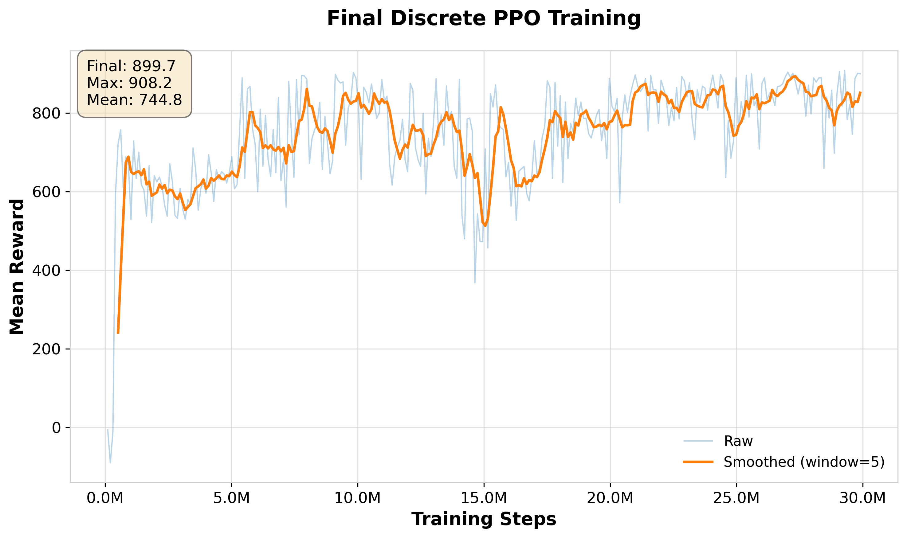
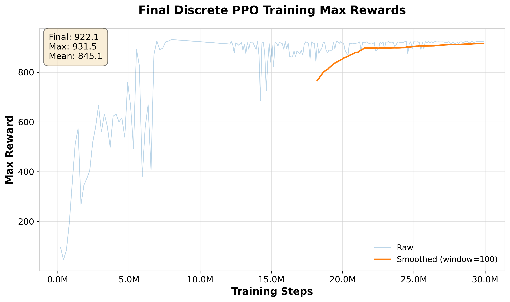
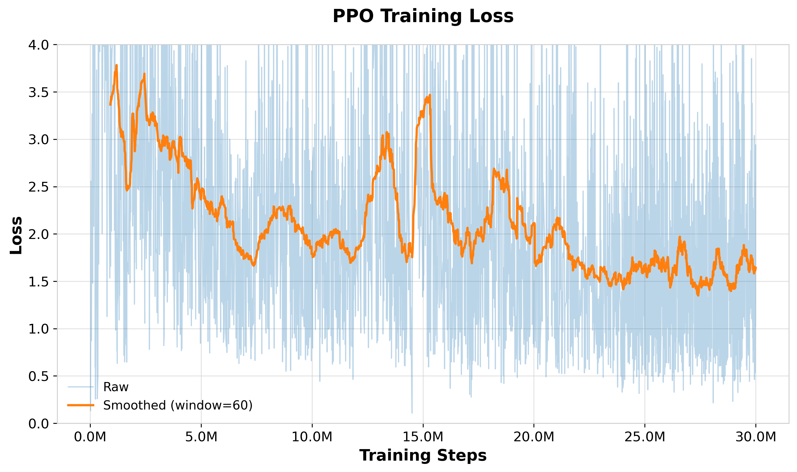
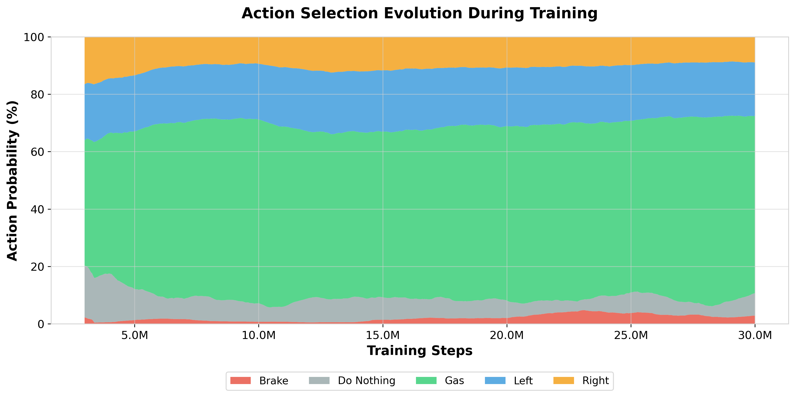
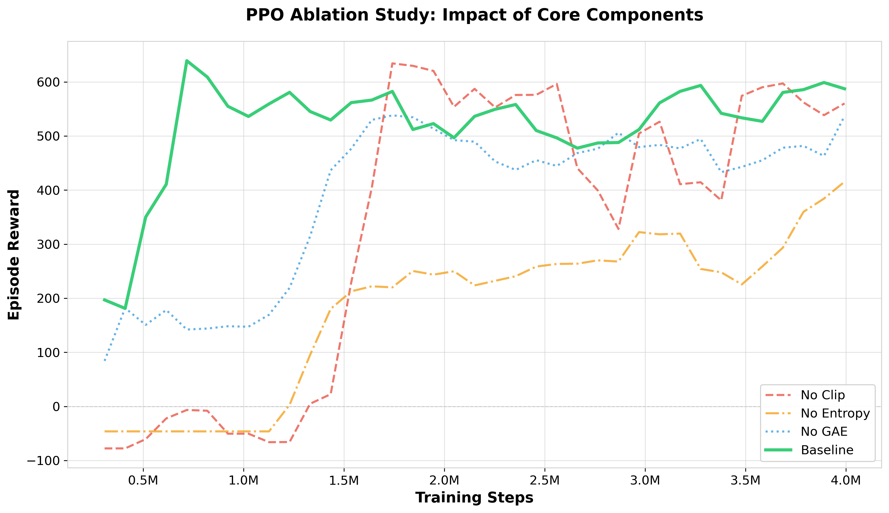
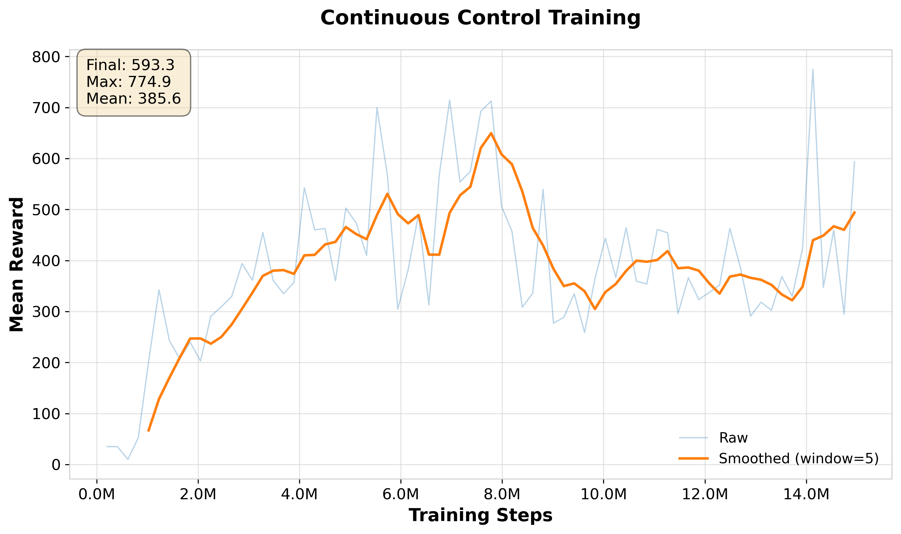
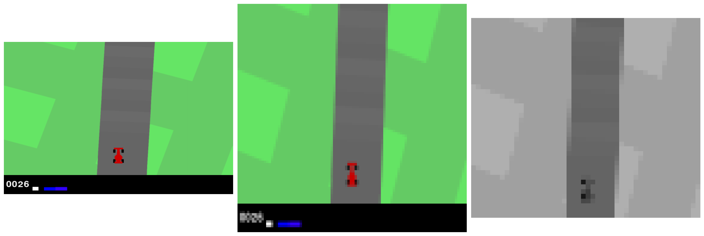

# PPO-CarRacing-v3

<p align="center">
  
  
  
  
  
</p>

<p align="center">
  Implementación <strong>desde cero</strong> de <strong>Proximal Policy Optimization (PPO-Clip)</strong> para entrenar un agente en el entorno <strong>CarRacing-v3</strong> de Gymnasium. Proyecto Final de <em>I404 - Aprendizaje Reforzado</em>.
</p>

---

<p align="center">
  
  <br>
  <em>Agente PPO entrenado con configuración SOTA</em>
</p>

---
El informe completo del proyecto está disponible en [`PPO_Car_Racing.pdf`](PPO_Car_Racing.pdf).

## Tabla de Contenidos

- [Resultados](#resultados)
- [Progresión del Aprendizaje](#progresión-del-aprendizaje)
- [Ablation Study](#ablation-study)
- [Arquitectura](#arquitectura)
- [Características](#características)
- [Instalación](#instalación)
- [Uso Rápido](#uso-rápido)
- [Configuración](#configuración)
- [Outputs del Entrenamiento](#outputs-del-entrenamiento)
- [Reanudar Entrenamiento](#reanudar-entrenamiento)
- [Experimentos Adicionales](#experimentos-adicionales)

---

## Resultados

### Curva de Entrenamiento (Discrete PPO — 30M timesteps)

<p align="center">
  
</p>

<p align="center">
  
</p>

### Pérdidas de Entrenamiento

<p align="center">
  
</p>

### Evolución de Acciones

<p align="center">
  
</p>

> La distribución de acciones refleja cómo el agente aprende progresivamente a preferir aceleración mantenida y correcciones precisas del volante, reduciendo casi por completo el frenado innecesario.

---

## Progresión del Aprendizaje

Comparación entre una configuración de entrenamiento media y la configuración SOTA:

<table align="center">
  <tr>
    <td align="center">
      
      <br><strong>Configuración media</strong>
    </td>
    <td align="center">
      
      <br><strong>Configuración SOTA</strong>
    </td>
  </tr>
</table>

---

## Ablation Study

Para cuantificar la contribución de cada componente, se entrenaron variantes sin cada módulo clave:

<p align="center">
  
</p>

| Variante | Componente eliminado | Descripción |
|---|---|---|
| **Baseline** | — | Configuración completa |
| `no_clip` | PPO-Clip | Sin clipping del ratio de política |
| `no_gae` | GAE | Sin Generalized Advantage Estimation |
| `no_entropy` | Entropy bonus | Sin regularización por entropía |
| `no_reward_shaping` | Reward shaping | Rewards originales sin transformar |
| `no_stack` | Frame stacking | Sin apilado de frames |

### Control Continuo

<p align="center">
  
</p>

---

## Arquitectura

```
Observación (96×96 RGB)
        │
        ▼
┌───────────────────┐
│  Preprocesamiento │  Grayscale → Crop → Normalize → Stack(2)
└────────┬──────────┘
         │  (2 × 84 × 84)
         ▼
┌───────────────────┐
│   CNN Encoder     │  Conv(8,4)→ReLU → Conv(16,2)→ReLU → Flatten → Linear(256)
└────────┬──────────┘
         │  latent (256)
    ┌────┴────┐
    ▼         ▼
┌────────┐ ┌────────┐
│ Actor  │ │ Critic │
│(π_θ)  │ │(V_φ)   │
└────────┘ └────────┘
   Dist(5)   V(s)
```

El agente utiliza una **arquitectura actor-crítico con pesos compartidos** en el encoder CNN.  
Las acciones discretas corresponden a: `← Izquierda`, `→ Derecha`, `↑ Gas`, `↓ Freno`, `⏸ Neutro`.

### Preprocesamiento

<p align="center">
  
</p>

---

## Características

- **PPO-Clip implementado desde cero** siguiendo el [paper original (Schulman et al., 2017)](https://arxiv.org/abs/1707.06347)
- **Entrenamiento vectorizado** con 16 entornos paralelos para mayor eficiencia muestral
- **Actor-Crítico con CNN compartida** para procesamiento de observaciones visuales
- **GAE** (Generalized Advantage Estimation) para reducir varianza del gradiente de política
- **Frame stacking** (2 frames RGB → grayscale) para capturar información temporal
- **Reward shaping** con clipping de recompensas positivas
- **Soporte discreto y continuo**: `Discrete(5)` y `Box(3)`
- **Ablation study** completo sobre todos los componentes
- **Experimentos de espacio latente**: PCA y β-VAE como reemplazo del CNN
- Configuración flexible mediante YAML · Logging con TensorBoard · Checkpointing

---

## Instalación

Requisitos: Python 3.10+, CUDA opcional (GPU).

### Con virtualenv

```bash
git clone https://github.com/<tu-usuario>/PPO-CarRacing-v3.git
cd PPO-CarRacing-v3
python3 -m venv .venv
source .venv/bin/activate
pip install -r requirements_venv.txt
```

### Con conda

```bash
conda create -n ppo_carracing python=3.10
conda activate ppo_carracing
pip install -r requirements_conda.txt
```

---

## Uso Rápido

### Jugar Manualmente

```bash
source .venv/bin/activate
python scripts/random/car_racing_human.py
```

Controles: flechas del teclado (`←` `→` `↑` `↓`).

### Entrenar un Agente

```bash
# Con configuración YAML (recomendado)
python scripts/training/train_with_config.py --config configs/ppo_config.yaml

# Sobrescribir parámetros desde CLI
python scripts/training/train_with_config.py \
    --config configs/ppo_config.yaml \
    --total-timesteps 5000000 \
    --num-envs 16 \
    --seed 42
```

### Visualizar Entrenamiento

```bash
tensorboard --logdir results/tensorboard_logs/ppo_clip
```

Abre `http://localhost:6006` en el navegador.

---

## Configuración

Edita `configs/ppo_config.yaml` para ajustar hiperparámetros:

```yaml
# Entrenamiento
total_timesteps: 12000000
seed: 42

# Entorno
num_envs: 16              # Entornos paralelos
num_stack: 2              # Frames apilados
frame_skip: 2             # Frames salteados entre apilados
discrete: true            # true: Discrete(5), false: Box(3)
reward_shaping: true      # Clip rewards positivos a +1

# Hiperparámetros PPO
num_steps: 128            # Steps por rollout antes de actualizar
num_minibatches: 4        # División del batch
update_epochs: 10         # Epochs sobre el batch completo
learning_rate: 0.0003
gamma: 0.99               # Discount factor
gae_lambda: 0.95          # GAE λ
clip_coef: 0.2            # Epsilon para PPO-Clip
ent_coef: 0.01            # Bonus de entropía
value_coef: 0.5           # Peso de value loss

# Evaluación y checkpointing
eval_episodes: 10
eval_interval: 50         # Evaluar cada N updates
save_interval: 50         # Guardar checkpoint cada N updates
```

### Configuraciones disponibles

| Archivo | Descripción |
|---|---|
| `ppo_config.yaml` | Configuración estándar — acciones discretas, 12M timesteps |
| `ppo_config_sota.yaml` | Configuración optimizada para mejor rendimiento |
| `ppo_config_cont.yaml` | Espacio de acciones continuo `Box(3)` |

---

## Outputs del Entrenamiento

Cada run genera automáticamente:

```
results/
├── models/ppo_clip/<run_name>/
│   ├── ppo_clip_update_50.pt      # Checkpoints periódicos
│   └── ppo_clip_final.pt          # Checkpoint final
│
├── tensorboard_logs/ppo_clip/<run_name>/
│   └── events.out.tfevents.*
│
└── videos/ppo_clip/<run_name>/
    └── policy_step_<N>.gif        # Videos del agente evaluado
```

### Métricas en TensorBoard

| Métrica | Descripción |
|---|---|
| `rollout/episode_return` | Reward total por episodio |
| `rollout/episode_length` | Duración del episodio en steps |
| `train/policy_loss` | Pérdida de la política (PPO-Clip objective) |
| `train/value_loss` | Pérdida del crítico (MSE) |
| `train/entropy` | Entropía de la política |
| `train/approx_kl` | KL divergence aproximada |
| `eval/return_mean` | Reward promedio en evaluación |
| `eval/death_rate` | Proporción de episodios terminados por salirse de pista |
| `actions/distribution` | Histograma de acciones |
| `policy/sample` | Videos de episodios (pestaña IMAGES) |

---

## Reanudar Entrenamiento

### Desde YAML

```yaml
# En configs/ppo_config.yaml
resume: "results/models/ppo_clip/ppo_clip_20251130-000046/ppo_clip_update_100.pt"
```

```bash
python scripts/training/train_with_config.py --config configs/ppo_config.yaml
```

### Desde CLI

```bash
python scripts/training/train_with_config.py \
    --config configs/ppo_config.yaml \
    --resume results/models/ppo_clip/<run_name>/ppo_clip_update_<N>.pt
```

El entrenamiento retoma desde el checkpoint conservando pesos del modelo, estado del optimizer y contadores de steps.

---

## Experimentos Adicionales

### Ablation Study

```bash
python scripts/training/ablation_study.py
```

Entrena automáticamente variantes sin: clipping, GAE, entropy bonus, reward shaping y frame stacking.

### Latent Space Experiments

Exploración de PCA y β-VAE como representación del estado en lugar del CNN:

```bash
python scripts/latent_space_experiment/1_collect_samples.py       # Recolectar frames
python scripts/latent_space_experiment/2_train_latent_models.py    # Entrenar PCA / VAE
python scripts/latent_space_experiment/3_analyze_latent_spaces.py  # Análisis de espacios
python scripts/latent_space_experiment/4_train_pca_ppo_agent.py    # PPO con PCA
python scripts/latent_space_experiment/5_generate_gif_from_model.py
```

---

## Estructura del Proyecto

```
PPO-CarRacing-v3/
├── configs/
│   ├── ppo_config.yaml
│   ├── ppo_config_sota.yaml
│   └── ppo_config_cont.yaml
│
├── src/
│   ├── ppo_clip/                  # Implementación de PPO
│   │   ├── agent.py               # Agente (policy + value)
│   │   ├── config.py              # Dataclass de configuración
│   │   ├── trainer.py             # Training loop
│   │   ├── rollout_buffer.py      # Buffer de experiencias + GAE
│   │   └── networks_*.py          # Arquitecturas CNN
│   ├── environment/
│   │   └── carracing.py           # Wrappers y preprocesamiento
│   ├── latent/
│   │   ├── reducers.py            # PCA, β-VAE
│   │   └── pca_ppo/               # PPO con observaciones latentes
│   └── utils/
│
├── scripts/
│   ├── training/
│   ├── latent_space_experiment/
│   └── random/                    # Demos y utilidades
│
└── results/
    ├── models/                    # Checkpoints
    ├── tensorboard_logs/
    ├── videos/                    # GIFs de episodios
    └── plot_from_tensorboard/     # Gráficos generados
```
